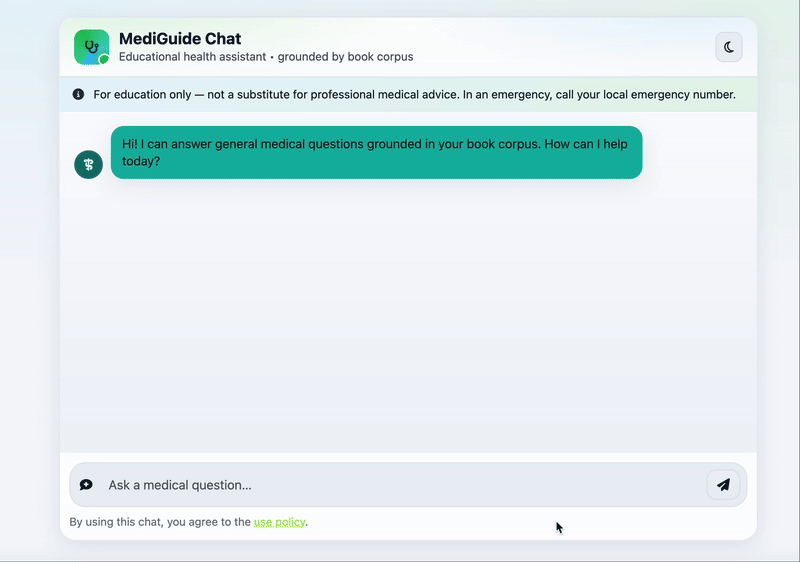

# 🩺 Medical RAG Chatbot – LangChain, Pinecone, Flask, AWS

A **Retrieval-Augmented Generation (RAG) Medical Chatbot** that answers user queries using a custom medical knowledge base.  
It combines **Large Language Models (LLMs)** with **vector search** to provide grounded, context-aware answers instead of relying purely on the model’s memory.

This project demonstrates **end-to-end AI application development**, covering data ingestion, embeddings, retrieval, UI, and cloud deployment.

---

## 🚀 Features

- **Retrieval-Augmented Generation (RAG):** Answers are grounded in a curated medical corpus.  
- **Custom Knowledge Base:** Documents embedded and stored in Pinecone for fast semantic search.  
- **Modern Web UI:** Flask + Bootstrap chat interface with dark/light mode and medical-themed styling.  
- **Cloud Native:** Containerized with Docker, deployable on AWS (ECR + EC2) via GitHub Actions CI/CD.  
- **Secure Setup:** Environment variables for API keys; `.gitignore` prevents sensitive files from leaking.  

---

## 🧠 How It Works (Approach)

1. **Load Data** → Preprocess PDFs, FAQs, or notes into clean text chunks.  
2. **Generate Embeddings** → Each chunk embedded with OpenAI embeddings.  
3. **Store in Pinecone** → Embeddings + metadata are stored for similarity search.  
4. **Query Processing** → User query hits Flask API, LangChain retrieves top-k matches from Pinecone.  
5. **RAG Pipeline** → Retrieved context + query passed into GPT.  
6. **Answer Generation** → GPT produces a grounded medical response.  
7. **Web UI** → Flask renders answers in a chat interface with timestamps and disclaimers.  

---

## 📊 System Design

### 🔄 RAG Runtime Flow
  
When a user asks a question, Flask forwards it to LangChain, Pinecone retrieves relevant chunks, GPT generates an answer, and the response is sent back to the UI.

### 📥 Data Ingestion Flow
  
Medical documents are loaded, cleaned, chunked, embedded using OpenAI, and stored in Pinecone for retrieval.

### 🚀 CI/CD Deployment Flow
  
GitHub Actions builds and pushes Docker images to Amazon ECR.  
EC2 self-hosted runners pull and run the container, exposing the chatbot on port `8080`.

---

## 🖥️ Demo



---

## 🛠️ Tech Stack

- **Python 3.11**  
- **LangChain** – RAG orchestration  
- **Pinecone** – Vector database  
- **OpenAI GPT** – LLM for natural language answers  
- **Flask** – Backend + chat UI  
- **Bootstrap 5 / FontAwesome** – UI styling  
- **Docker** – Containerization  
- **AWS (ECR + EC2 + GitHub Actions)** – Deployment pipeline  

---

## ⚡ Run Options

There are three easy ways to run this project:

### ✅ Option 1: Easiest (run.sh)
1. Create a `.env` file in the root:
   ```ini
   PINECONE_API_KEY="xxxxxxxxxxxxxxxxxxxxxxxxxxxxx"
   OPENAI_API_KEY="xxxxxxxxxxxxxxxxxxxxxxxxxxxxx"
    ````

2. Make the script executable and run:

   ```bash
   chmod +x run.sh
   ./run.sh
   ```

This will initialize Pinecone (if not already), install dependencies, and start the app.
Open [http://127.0.0.1:8080](http://127.0.0.1:8080).

---

### 📝 Option 2: Manual Sequential Steps

For finer control, you can run everything step by step:

```bash
# 1. Clone
git clone https://github.com/sushant097/medical-rag-chatbot.git
cd medical-rag-chatbot

# 2. Create conda environment
conda create -n medichatbot python=3.11 -y
conda activate medichatbot

# 3. Install dependencies
pip install -r requirements.txt

# 4. Add .env file with Pinecone + OpenAI keys

# 5. Store embeddings
python store_index.py

# 6. Start app
python app.py
```

---

### 🐳 Option 3: Docker

If you prefer Dockerized deployment:

```bash
# Build image
docker build -t medibot .

# Run container with env vars from .env
docker run -d -p 8080:8080 --env-file .env medibot
```

---

## ☁️ Deployment (AWS CI/CD)

This repo includes a **GitHub Actions workflow** (`.github/workflows/cicd.yaml`) for seamless deployment:

1. Build & push Docker image to **Amazon ECR**.
2. EC2 self-hosted runner pulls the image.
3. Flask app runs in a container on port `8080`.

Required GitHub Secrets:

* `AWS_ACCESS_KEY_ID`
* `AWS_SECRET_ACCESS_KEY`
* `AWS_DEFAULT_REGION`
* `ECR_REPO`
* `PINECONE_API_KEY`
* `OPENAI_API_KEY`

---

## 📂 Project Structure

```
.
├── app.py               # Flask app (chat UI + backend)
├── store_index.py       # Embed & upload docs to Pinecone
├── src/                 # Utilities & prompt templates
│   ├── utils.py
│   ├── prompt.py
│   └── __init__.py
├── templates/           # HTML templates (chat UI)
│   └── chat.html
├── static/              # CSS/JS assets
│   └── chat.css
├── requirements.txt     # Python dependencies
├── run.sh               # Bootstrap & run script
├── Dockerfile           # Docker build
├── .env.example         # Example env vars
├── .gitignore           # Ignore secrets & caches
└── README.md            # Project documentation
```

---

## 📜 License

[MIT](LICENSE)

