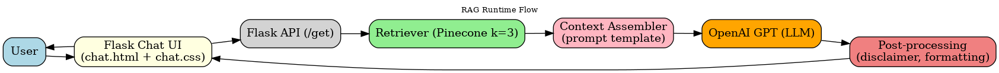
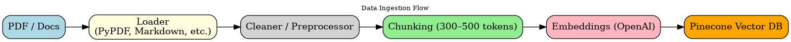
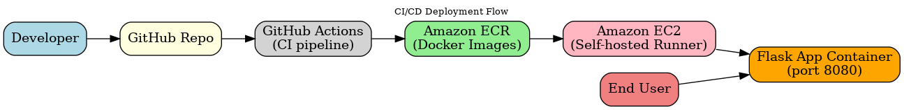

# 🩺 Medical RAG Chatbot – LangChain, Pinecone, Flask, AWS

A **Retrieval-Augmented Generation (RAG) Medical Chatbot** that can answer user queries using a custom medical knowledge base.  
It combines **Large Language Models (LLMs)** with **vector search** to provide grounded, context-aware answers instead of relying purely on the model’s memory.

This project is designed as part of **end-to-end AI application development**, covering data ingestion, embeddings, retrieval, UI, and cloud deployment.

---

## 🚀 Features

- **Retrieval-Augmented Generation (RAG):** Answers are grounded in your uploaded medical corpus.  
- **Custom Knowledge Base:** Documents are embedded and stored in Pinecone for fast similarity search.  
- **Modern Web UI:** Flask + Bootstrap chat interface with dark/light mode, medical theme, and responsive design.  
- **Cloud Native:** Containerized with Docker and deployable to AWS (ECR + EC2) via GitHub Actions CI/CD.  
- **Secure Setup:** Environment variables for API keys, `.gitignore` to prevent secrets leakage.  

---

## 🧠 How It Works (Approach)

1. **Load Data**  
   - Medical documents (PDFs, research, FAQs, etc.) are preprocessed into chunks.  

2. **Generate Embeddings**  
   - Each chunk is embedded using OpenAI embeddings (or other models).  

3. **Store in Pinecone**  
   - Embeddings are upserted into a Pinecone vector database for scalable semantic search.  

4. **User Query → Retrieval**  
   - When the user asks a question, the chatbot retrieves the most relevant chunks from Pinecone.  

5. **RAG Pipeline**  
   - LangChain combines retrieved chunks with the user’s query and feeds it into the LLM.  

6. **Answer Generation**  
   - The LLM (via OpenAI) generates a contextual, medically grounded response.  

7. **Flask Web UI**  
   - The response is displayed in a chat-style UI built with Bootstrap, including timestamps and user/bot avatars.  

---

## 📊 System Design

### 🔄 RAG Runtime Flow


When a user asks a question in the chat UI:

1. The query goes to Flask (`/get`).
2. LangChain retrieves top-k chunks from Pinecone.
3. Context is assembled into a prompt.
4. OpenAI GPT generates a grounded response.
5. The answer is returned to the chat UI with disclaimer formatting.


### 📥 Data Ingestion Flow


Before answering questions, medical documents are prepared:

1. Load PDFs, FAQs, or research notes.
2. Clean and normalize the text.
3. Split into overlapping chunks.
4. Generate embeddings with OpenAI.
5. Store them in Pinecone for fast semantic search.


### 🚀 CI/CD Deployment Flow


Code is deployed automatically using GitHub Actions + AWS:

1. Push changes to GitHub.
2. GitHub Actions builds and pushes Docker images to Amazon ECR.
3. EC2 (self-hosted runner) pulls the image.
4. Flask app container runs on port `8080`, serving the chatbot to end users.

---

## 🖥️ Demo

👉 *Placeholder for gifhy demo*  

---

## 🛠️ Tech Stack

- **Python 3.11**  
- **LangChain** – RAG orchestration  
- **Pinecone** – Vector DB for semantic search  
- **OpenAI GPT** – LLM for natural language answers  
- **Flask** – Web server and chatbot interface  
- **Bootstrap 5 / FontAwesome** – Modern chat UI  
- **Docker** – Containerization  
- **AWS (ECR + EC2 + GitHub Actions)** – CI/CD and deployment  

---

## ⚡ Quickstart (Local)

1. **Clone the repository**
   ```bash
   git clone https://github.com/sushant097/medical-rag-chatbot.git
   cd medical-rag-chatbot
    ````

2. **Create a conda environment**

   ```bash
   conda create -n medichatbot python=3.11 -y
   conda activate medichatbot
   ```

3. **Install dependencies**

   ```bash
   pip install -r requirements.txt
   ```

4. **Create a `.env` file**
   Add your credentials:

   ```ini
   PINECONE_API_KEY="xxxxxxxxxxxxxxxxxxxxxxxxxxxxx"
   OPENAI_API_KEY="xxxxxxxxxxxxxxxxxxxxxxxxxxxxx"
   ```

5. **Run setup + start app**

   ```bash
   chmod +x run.sh
   ./run.sh
   ```

6. **Access the chatbot**
   Open [http://127.0.0.1:8080](http://127.0.0.1:8080) in your browser.

---

## ☁️ Deployment (AWS CI/CD)

This repo includes a **GitHub Actions workflow** (`.github/workflows/cicd.yaml`) for seamless deployment:

1. Build and push Docker image to **Amazon ECR**.
2. Launch **EC2 self-hosted runner**.
3. Pull and run the latest image with environment variables injected from GitHub Secrets.

Required AWS IAM Policies:

* `AmazonEC2ContainerRegistryFullAccess`
* `AmazonEC2FullAccess`

Required GitHub Secrets:

* `AWS_ACCESS_KEY_ID`
* `AWS_SECRET_ACCESS_KEY`
* `AWS_DEFAULT_REGION`
* `ECR_REPO`
* `PINECONE_API_KEY`
* `OPENAI_API_KEY`

---

## 📂 Project Structure

```
.
├── app.py               # Flask app (chat UI + backend)
├── store_index.py       # Embed & upload docs to Pinecone
├── src/                 # Utilities & prompt templates
│   ├── utils.py
│   ├── prompt.py
│   └── __init__.py
├── templates/           # HTML templates (chat UI)
│   └── chat.html
├── static/              # CSS/JS assets
│   └── chat.css
├── requirements.txt     # Python dependencies
├── run.sh               # Bootstrap & run script
├── Dockerfile           # Docker build
├── .env.example         # Example env vars
├── .gitignore           # Ignore secrets & caches
└── README.md            # Project documentation
```

---

## 📜 License

[MIT](LICENSE)
